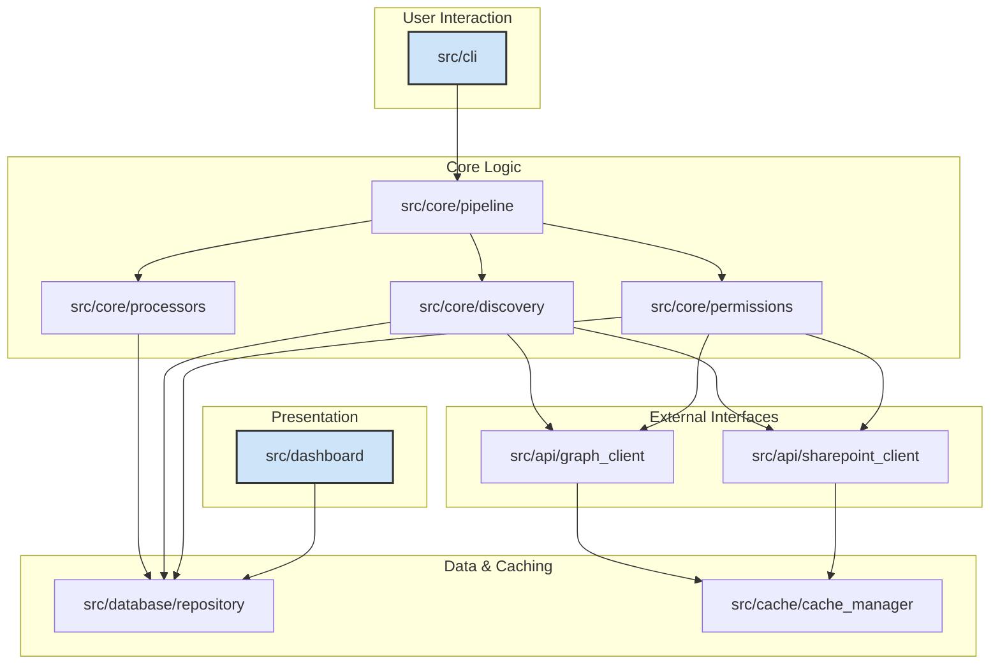
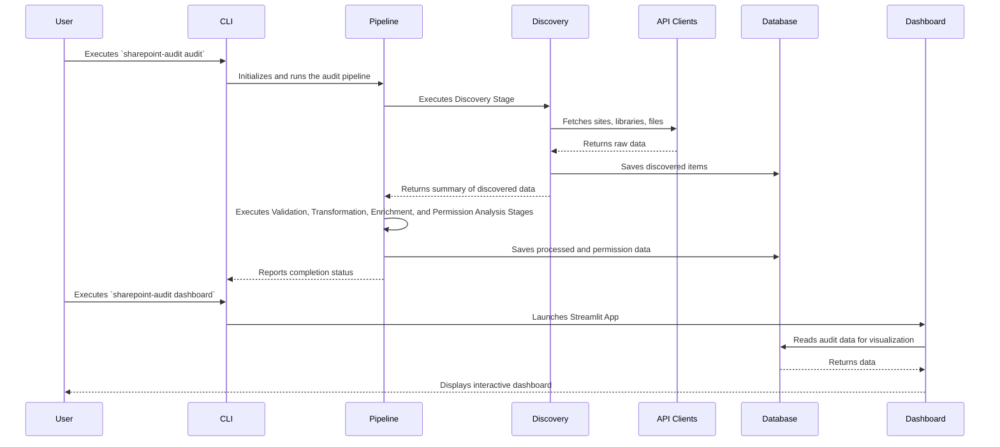

# Software Architecture Document: SharePoint Auditing Tool

## 1. High-Level Overview

The application is a comprehensive SharePoint auditing tool designed to scan, analyze, and report on SharePoint environments. It systematically gathers data on sites, files, user permissions, and other resources, processes this information, and persists it in a local SQLite database. The primary objective is to provide a detailed and actionable audit of a SharePoint environment, which can be explored and visualized through a web-based dashboard.

The tool is operated via a command-line interface (CLI), which serves as the main entry point and orchestrates the entire pipeline—from data discovery and processing to reporting and visualization. The architecture is designed to be modular, scalable, and maintainable, with a clear separation of concerns between the different components.

### 1.1. Architectural Goals

*   **Modularity**: Each component has a single, well-defined responsibility, making the system easier to understand, develop, and test.
*   **Scalability**: The application is designed to handle large SharePoint environments through asynchronous operations, a queue-based discovery mechanism, and efficient batch processing.
*   **Extensibility**: The modular design and pipeline architecture allow for the addition of new features, such as new data processors, permission analyzers, or export formats, with minimal impact on existing components.
*   **Maintainability**: The codebase is organized logically, with a clean separation between the API interaction, core business logic, data persistence, and presentation layers.

## 2. Component-Level Architecture

The application is composed of several key components that work together to deliver the auditing functionality. The following diagram illustrates the high-level interaction between these components:

### 2.1. Key Components and Their Responsibilities

-   **`src/cli`**: The main entry point for the application. It utilizes the `click` library to provide a rich command-line interface. The CLI is responsible for parsing user input and configuration from `config/config.json`, setting up the application environment (including logging), and initiating the audit pipeline. Key files like [`src/cli/main.py`](src/cli/main.py) and [`src/cli/commands.py`](src/cli/commands.py) define the command structure (`audit`, `dashboard`, `backup`, `restore`, `health`) and their corresponding options.

-   **`src/api`**: This component abstracts all communication with external services, primarily the Microsoft Graph API and the SharePoint REST API. It handles authentication via `msal` and `azure-identity`, session management using `aiohttp`, rate limiting, and a retry mechanism (`tenacity`) for resilient API requests.
    -   [`src/api/graph_client.py`](src/api/graph_client.py): Interacts with the Microsoft Graph API to retrieve high-level information about SharePoint sites, users, and groups.
    -   [`src/api/sharepoint_client.py`](src/api/sharepoint_client.py): Communicates directly with SharePoint sites via their REST APIs to fetch detailed information about lists, libraries, files, and permissions.

-   **`src/core`**: This is the heart of the application, containing the core business logic for the audit process. It defines the data models, orchestrates the discovery and processing of SharePoint data, and manages the overall pipeline.
    -   [`src/core/pipeline.py`](src/core/pipeline.py): Defines the `AuditPipeline` and `PipelineStage` classes that orchestrate the audit as a sequence of stages (Discovery, Validation, Transformation, Enrichment, Permissions, Storage).
    -   [`src/core/discovery.py`](src/core/discovery.py) & [`src/core/discovery_queue_based.py`](src/core/discovery_queue_based.py): Implement the logic for discovering SharePoint resources (sites, libraries, folders, files) in an efficient and scalable manner using a queue-based approach for traversing site contents.
    -   [`src/core/models.py`](src/core/models.py): Defines the `dataclasses` that represent the data structures used throughout the application (e.g., `Site`, `Library`, `File`).
    -   [`src/core/processors.py`](src/core/processors.py): Contains the logic for the different pipeline stages, including validating, transforming, and enriching the discovered data.
    -   [`src/core/permissions.py`](src/core/permissions.py): Contains the `PermissionAnalyzer` responsible for deep-diving into the permission structure of each SharePoint object.

-   **`src/database`**: This component manages all interactions with the local SQLite database. It uses raw `sqlite3` calls for asynchronous operations.
    -   [`src/database/models.py`](src/database/models.py): Defines the database schema, including all `CREATE TABLE`, `CREATE INDEX`, and `CREATE VIEW` statements.
    -   [`src/database/repository.py`](src/database/repository.py): Implements the repository pattern, offering a clean and consistent interface for all database operations (e.g., `bulk_insert`, `bulk_upsert`, `fetch_all`).

-   **`src/dashboard`**: This component provides a web-based user interface for visualizing the audited data. It is built using `streamlit`.
    -   [`src/dashboard/streamlit_app.py`](src/dashboard/streamlit_app.py): The main entry point for the Streamlit dashboard.
    -   The `src/dashboard/pages/` directory contains the different pages of the dashboard, such as overviews, file lists, and permission reports.

-   **`src/cache`**: This component provides a caching layer to reduce the number of API calls and speed up the auditing process. It uses an in-memory cache (`cachetools`) by default but can be configured to use Redis. [`src/cache/cache_manager.py`](src/cache/cache_manager.py) contains the implementation.

## 3. Data Flow

The data flow is unidirectional and orchestrated by the core pipeline, ensuring a predictable and traceable process from start to finish.

1.  **Initiation**: A user runs the application from the `CLI`, which triggers the `AuditPipeline` defined in [`src/core/pipeline.py`](src/core/pipeline.py).
2.  **Discovery**: The pipeline's `DiscoveryStage` uses the [`src/api/graph_client.py`](src/api/graph_client.py) to discover all SharePoint sites. For each site, it enumerates all resources (document libraries, lists, files, folders) and saves them to the `Database`.
3.  **Processing**: As data is discovered, subsequent pipeline stages (Validation, Transformation, Enrichment) process it. This includes normalizing data formats, validating data integrity, and adding calculated fields.
4.  **Permission Analysis**: The `PermissionAnalysisStage` uses both the `GraphAPIClient` and `SharePointAPIClient` to analyze the permissions for each discovered item, identifying unique permissions and external sharing.
5.  **Storage**: The final `StorageStage` ensures all processed data, including detailed permission information, is stored in the local SQLite `Database` via the [`src/database/repository.py`](src/database/repository.py).
6.  **Visualization**: After the audit is complete, the user can launch the `Dashboard`. The Streamlit application reads the data from the `Database` and presents it in a user-friendly web interface.

## 4. Software Bill of Materials (SBOM)

This section details the external dependencies required by the project.

### 4.1. Production Dependencies (`requirements.txt`)

| Package | Version | Description |
|---|---|---|
| aiohttp | 3.12.13 | Asynchronous HTTP Client/Server for asyncio. |
| aiosqlite | 0.21.0 | AsyncIO bridge to the standard sqlite3 module. |
| altair | 5.5.0 | Declarative statistical visualization library for Python. |
| azure-identity | 1.23.0 | Azure Identity client library for Python. |
| cachetools | 6.1.0 | Extensible memoizing collections and decorators. |
| click | 8.2.1 | Composable command line interface toolkit. |
| cryptography | 45.0.4 | Cryptographic recipes and primitives for Python. |
| msgraph-sdk | 1.35.0 | Microsoft Graph SDK for Python. |
| office365-rest-python-client | 2.6.2 | SharePoint and Microsoft 365 Library for Python. |
| pandas | 2.3.0 | Powerful data structures for data analysis, time series, and statistics. |
| plotly | 6.2.0 | Interactive graphing library for Python. |
| prometheus-client | 0.22.1 | Prometheus instrumentation library for Python applications. |
| psutil | 7.0.0 | Cross-platform lib for process and system monitoring in Python. |
| python-dateutil | 2.9.0.post0 | Extensions to the standard Python datetime module. |
| python-json-logger | 3.3.0 | A python library for structured logging in JSON format. |
| pyyaml | 6.0.2 | YAML parser and emitter for Python. |
| redis | 6.2.0 | Python client for Redis key-value store. |
| rich | 14.0.0 | Rich text and beautiful formatting in the terminal. |
| sqlalchemy | 2.0.41 | The Python SQL Toolkit and Object Relational Mapper. |
| streamlit | 1.46.1 | The fastest way to build data apps in Python. |
| streamlit-aggrid | 1.1.6 | An integration of AG-Grid with Streamlit. |
| tenacity | 9.1.2 | Retrying library for Python. |
| tqdm | 4.67.1 | A Fast, Extensible Progress Bar for Python and CLI. |

### 4.2. Development Dependencies (`requirements-dev.txt`)

| Package | Version | Description |
|---|---|---|
| black | 25.1.0 | The uncompromising Python code formatter. |
| flake8 | 7.3.0 | Tool for style guide enforcement. |
| mypy | 1.16.1 | Optional static typing for Python. |
| pre-commit | 4.2.0 | A framework for managing and maintaining multi-language pre-commit hooks. |
| pytest | 8.4.1 | A framework for writing small, readable tests. |
| pytest-asyncio | 1.0.0 | Pytest support for asyncio. |
| pytest-cov | 6.2.1 | Pytest plugin for measuring coverage. |
