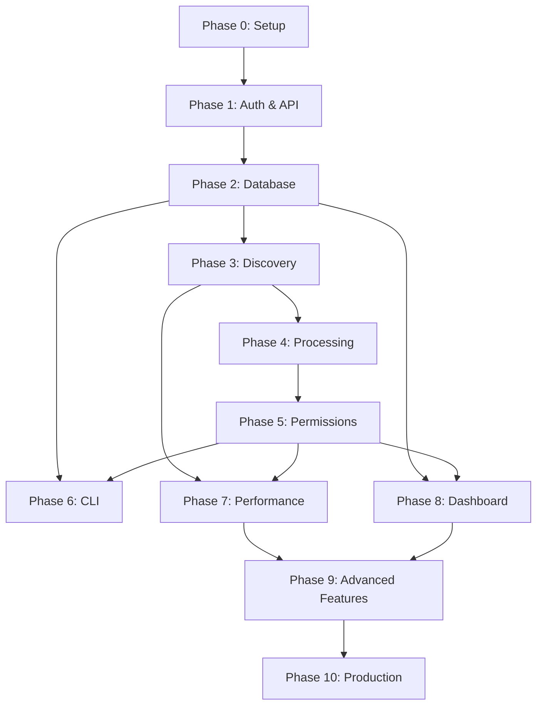

# SharePoint Audit Utility - Development Phases

## Table of Contents

1.  [Overview](#overview)
2.  [Phase 0: Project Setup & Infrastructure](#phase-0-project-setup--infrastructure)
3.  [Phase 1: Core Authentication & API Client](#phase-1-core-authentication--api-client)
4.  [Phase 2: Database Layer & Models](#phase-2-database-layer--models)
5.  [Phase 3: Basic Discovery Module](#phase-3-basic-discovery-module)
6.  [Phase 4: Data Processing Pipeline](#phase-4-data-processing-pipeline)
7.  [Phase 5: Permission Analysis](#phase-5-permission-analysis)
8.  [Phase 6: CLI Interface](#phase-6-cli-interface)
9.  [Phase 7: Performance & Caching](#phase-7-performance--caching)
10. [Phase 8: Streamlit Dashboard](#phase-8-streamlit-dashboard)
11. [Phase 9: Advanced Features](#phase-9-advanced-features)
12. [Phase 10: Production Hardening](#phase-10-production-hardening)
13. [Testing Strategy](#testing-strategy)
14. [Progress Tracking](#progress-tracking)

## Overview

This document outlines the phased development approach for the SharePoint Audit Utility. Each phase builds upon the previous ones, with clear deliverables, test criteria, and verification steps. The phases are designed to provide incremental value while maintaining a stable, testable codebase throughout development.

### Development Principles

1.  **Incremental Value**: Each phase delivers working, testable functionality.
2.  **Test-Driven**: Comprehensive tests are written for each feature before or during implementation.
3.  **Architecture-Aligned**: Development directly follows the specifications in the `ARCHITECTURE.md`.
4.  **Secure by Design**: Security considerations are integrated into every phase, not as an afterthought.
5.  **Observable**: Logging and metrics are built-in from the start.
6.  **Continuous Integration**: Each phase must pass all CI checks before being considered complete.

### Phase Dependencies



## Phase 0: Project Setup & Infrastructure

### Overview
Establish the project foundation including directory structure, development environment, configuration management, and basic utilities. This phase ensures a solid and consistent starting point for all subsequent development.

### Prerequisites
- Python 3.11+ installed
- Git repository initialized

### Deliverables

1.  **Project Structure**: A complete directory structure as defined in `ARCHITECTURE.md`.
    ```
    sharepoint_audit/
    ├── src/
    │   ├── cli/
    │   ├── api/
    │   ├── core/
    │   ├── database/
    │   ├── cache/
    │   ├── dashboard/
    │   └── utils/
    ├── tests/
    ├── config/
    ├── docs/
    ├── scripts/
    ├── setup.py
    ├── requirements.txt
    ├── requirements-dev.txt
    ├── pytest.ini
    ├── .gitignore
    └── README.md
    ```

2.  **Core Utilities**: Foundational utilities for logging, configuration, and custom exceptions.
    - `src/utils/logger.py`: Centralized logging configuration (`LoggingConfiguration`).
    - `src/utils/config_parser.py`: Typed configuration models (`AppConfig`, `AuthConfig`, etc.).
    - `src/utils/exceptions.py`: Base custom exception classes (`SharePointAuditError`, `APIError`).

3.  **Development Environment**:
    - Scripts for setting up a virtual environment (`venv`).
    - `pre-commit` hooks for automated linting and formatting (Black, Flake8, MyPy).
    - `.editorconfig` and `.vscode/` settings for consistent development standards.

### Implementation Tasks

- [ ] Create the full directory structure.
- [ ] Initialize Python package structure with `__init__.py` files.
- [ ] Create `setup.py` with all dependencies from `ARCHITECTURE.md`.
- [ ] Create `requirements.txt` and `requirements-dev.txt`.
- [ ] Implement `LoggingConfiguration` in `src/utils/logger.py` based on the architecture.
- [ ] Define data classes for configuration in `src/utils/config_parser.py`.
- [ ] Define base exception classes in `src/utils/exceptions.py`.
- [ ] Configure `pytest.ini` for test discovery and markers.
- [ ] Configure and install pre-commit hooks (`.pre-commit-config.yaml`).
- [ ] Create an initial `README.md` and `.gitignore`.

### Test Cases

```python
# tests/test_setup.py
import logging
from src.utils.logger import LoggingConfiguration
from src.utils.config_parser import AppConfig

def test_logging_setup():
    """Verify that the logging configuration can be initialized."""
    LoggingConfiguration.setup_logging()
    logger = logging.getLogger("sharepoint_audit")
    assert logger.level == logging.DEBUG

def test_config_model():
    """Verify that the configuration model can be instantiated."""
    # This is a basic test; file loading will be tested later.
    config = AppConfig(auth=AuthConfig(...), db=DbConfig(...))
    assert config is not None

def test_installation():
    """Verify that the package can be installed in editable mode."""
    import subprocess
    result = subprocess.run(["pip", "install", "-e", "."], capture_output=True, text=True)
    assert result.returncode == 0, "pip install -e . failed"
```

### Done Criteria

- [ ] `pip install -e .[dev]` completes successfully.
- [ ] `pre-commit install` completes successfully and hooks run on commit.
- [ ] `pytest tests/` runs and discovers initial tests.
- [ ] The directory structure matches the architecture document.
- [ ] Basic logging and configuration models are implemented and pass tests.

### Verification Steps

```bash
# 1. Set up the environment
python3 -m venv venv
source venv/bin/activate
pip install -e .[dev]
pre-commit install

# 2. Run initial tests
pytest

# 3. Manually trigger a pre-commit run
git add .
git commit -m "feat: Initial project setup" --no-verify # First commit
# Make a small change and commit again to test hooks
# git commit -m "test: pre-commit hooks"
```

## Phase 1: Core Authentication & API Client

### Overview
Implement a robust and resilient client for interacting with SharePoint and Microsoft Graph APIs. This includes certificate-based authentication, automatic token management, rate limiting, and a retry strategy with a circuit breaker.

### Prerequisites
- Phase 0 complete.
- Access to a SharePoint test tenant with an App Registration (Client ID, Tenant ID).
- A valid certificate (PEM format) with its thumbprint for authentication.

### Deliverables

1.  **Authentication Manager**: `src/api/auth_manager.py`
    - `AuthenticationManager` class handling certificate-based auth for both SharePoint and Graph.
    - Securely loads certificate details from configuration.
    - Caches and reuses authenticated contexts (`ClientContext`, `GraphServiceClient`).

2.  **Resilient API Clients**: `src/api/sharepoint_client.py`, `src/api/graph_client.py`
    - `SharePointAPIClient` and `GraphAPIClient` classes that encapsulate all API interactions.
    - Implements `get_with_retry`, `post_with_retry`, and `batch_request` methods.

3.  **Error Handling & Resilience**: `src/utils/retry_handler.py`, `src/utils/rate_limiter.py`
    - `RetryStrategy` class implementing exponential backoff with jitter.
    - `CircuitBreaker` class to prevent hammering a failing service.
    - `RateLimiter` class to manage consumption of SharePoint resource units and handle `Retry-After` headers.

### Implementation Tasks

- [ ] Implement `AuthenticationManager` to get authenticated `ClientContext` and `GraphServiceClient`.
- [ ] Implement `RateLimiter` based on Microsoft's resource unit model.
- [ ] Implement `RetryStrategy` with exponential backoff and jitter.
- [ ] Implement the `CircuitBreaker` pattern.
- [ ] Create the `SharePointAPIClient` and `GraphAPIClient`, integrating the auth manager, rate limiter, and retry strategy.
- [ ] Implement batch request processing for both SharePoint and Graph APIs to bundle multiple requests.
- [ ] Add structured logging to all API interactions, including request details, response status, and latency.
- [ ] Define specific API exception classes (`SharePointAPIError`, `GraphAPIError`).

### Test Cases

```python
# tests/test_api.py
import pytest
from unittest.mock import AsyncMock, patch

@pytest.mark.asyncio
async def test_sharepoint_auth_success(auth_manager):
    """Test successful SharePoint authentication against a mock context."""
    with patch('src.api.auth_manager.ClientContext') as MockContext:
        ctx = await auth_manager.get_sharepoint_context("https://tenant.sharepoint.com/sites/test")
        assert ctx is not None
        MockContext.connect_with_certificate.assert_called_once()

@pytest.mark.asyncio
async def test_retry_on_429(api_client):
    """Test that the client automatically retries on a 429 (throttling) response."""
    with patch('aiohttp.ClientSession.get') as mock_get:
        # Simulate one 429 response, then a 200 response
        mock_get.side_effect = [
            AsyncMock(status=429, headers={'Retry-After': '1'}),
            AsyncMock(status=200, json=AsyncMock(return_value={'ok': True}))
        ]
        response = await api_client.get_with_retry("https://api.test.com/endpoint")
        assert response['ok'] is True
        assert mock_get.call_count == 2

@pytest.mark.asyncio
async def test_circuit_breaker_opens(retry_strategy):
    """Test that the circuit breaker opens after repeated failures."""
    # Simulate a function that always fails
    failing_func = AsyncMock(side_effect=Exception("API Down"))
    
    for _ in range(retry_strategy.circuit_breakers['test'].failure_threshold):
        with pytest.raises(Exception):
            await retry_strategy.execute_with_retry("test", failing_func)

    # The circuit should now be open
    with pytest.raises(CircuitBreakerOpenError):
        await retry_strategy.execute_with_retry("test", failing_func)
```

### Done Criteria

- [ ] Authentication to both SharePoint and Graph APIs is successful using a real test tenant.
- [ ] API calls are automatically retried on transient errors (e.g., 503) and throttling (429).
- [ ] The circuit breaker opens after a configurable number of consecutive failures.
- [ ] The rate limiter correctly throttles requests to stay within defined resource unit limits.
- [ ] All tests for authentication, retries, and rate limiting pass.

### Verification Steps

```python
# scripts/verify_api.py
import asyncio
from src.utils.config_parser import load_config
from src.api.auth_manager import AuthenticationManager
from src.api.graph_client import GraphAPIClient

async def main():
    config = load_config("config/config.json")
    auth_manager = AuthenticationManager(config.auth)
    graph_client = GraphAPIClient(auth_manager) # Simplified for verification
    
    print("Attempting to get sites via Graph API...")
    sites_result = await graph_client.get_all_sites_delta()
    print(f"Successfully retrieved {len(sites_result.items)} sites.")
    if sites_result.delta_token:
        print("Received a delta token for future incremental syncs.")

if __name__ == "__main__":
    asyncio.run(main())
```

## Phase 2: Database Layer & Models

### Overview
Implement the SQLite database layer using an asynchronous repository pattern. This includes defining all tables, views, and indexes as specified in the architecture to ensure high performance and data integrity.

### Prerequisites
- Phase 0 complete.
- A clear understanding of the data model from `ARCHITECTURE.md`.

### Deliverables

1.  **Database Models**: `src/database/models.py`
    - SQLAlchemy Core or ORM models for all tables: `tenants`, `sites`, `libraries`, `folders`, `files`, `permissions`, `groups`, `group_members`, `audit_runs`, and `audit_checkpoints`.
    - All columns, data types, relationships, and constraints defined as per the architecture.

2.  **Repository Layer**: `src/database/repository.py`
    - `DatabaseRepository` class providing an async interface for all database operations.
    - Methods for CRUD operations, bulk inserts (`bulk_insert`), and complex queries (e.g., `get_permission_summary`).
    - An async transaction context manager.

3.  **Database Initialization & Optimization**: `src/database/optimizer.py`
    - `DatabaseOptimizer` class to initialize a new database.
    - Sets performance-critical PRAGMA settings (`journal_mode=WAL`, `synchronous=NORMAL`, `cache_size`, etc.).
    - Creates all tables, indexes, and views as defined in the architecture.

### Implementation Tasks

- [ ] Define SQLAlchemy models for all tables in `src/database/models.py`.
- [ ] Implement the `DatabaseRepository` with async methods for all required database interactions.
- [ ] Implement a highly optimized `bulk_insert` method using `executemany`.
- [ ] Implement the `DatabaseOptimizer` to set PRAGMAs and create the full schema, including all indexes and views.
- [ ] Implement an async transaction context manager in the repository to ensure atomicity.
- [ ] Implement methods in the repository to query the predefined views (`vw_permission_summary`, `vw_storage_analytics`).
- [ ] Add comprehensive logging for database operations, especially for errors and long-running queries.

### Test Cases

```python
# tests/test_database.py
import pytest

@pytest.fixture
async def db_repo(tmp_path):
    """Create a temporary, in-memory database repository for testing."""
    db_path = tmp_path / "test_audit.db"
    repo = DatabaseRepository(db_path)
    await repo.initialize_database() # Creates schema
    return repo

@pytest.mark.asyncio
async def test_full_schema_creation(db_repo):
    """Verify that all tables and views are created on initialization."""
    async with db_repo.engine.connect() as conn:
        # Check for a few key tables and a view
        assert await conn.run_sync(lambda sync_conn: "sites" in sync_conn.dialect.get_table_names(sync_conn))
        assert await conn.run_sync(lambda sync_conn: "permissions" in sync_conn.dialect.get_table_names(sync_conn))
        assert await conn.run_sync(lambda sync_conn: "vw_permission_summary" in sync_conn.dialect.get_view_names(sync_conn))

@pytest.mark.asyncio
async def test_bulk_insert_performance(db_repo):
    """Test that bulk insert is efficient for a large number of records."""
    files = [{'file_id': f'f{i}', 'name': f'doc{i}.txt', ...} for i in range(10000)]
    inserted_count = await db_repo.bulk_insert('files', files)
    assert inserted_count == 10000

@pytest.mark.asyncio
async def test_transaction_rollback(db_repo):
    """Test that a transaction is rolled back upon encountering an error."""
    try:
        async with db_repo.transaction():
            await db_repo.save_site(...) # Save a site
            raise ValueError("Simulating an error")
    except ValueError:
        pass # Expected error
    
    # Verify the site was not saved
    site = await db_repo.get_site(...)
    assert site is None
```

### Done Criteria

- [ ] The database initialization script successfully creates a SQLite file with the complete schema, including all tables, indexes, and views.
- [ ] The `bulk_insert` method can insert over 10,000 records in a single transaction efficiently.
- [ ] The transaction manager correctly commits on success and rolls back on failure.
- [ ] All repository methods are implemented and covered by unit tests.
- [ ] Performance-critical PRAGMA settings are applied and verified.

### Verification Steps

```bash
# 1. Run the database initialization script
python -c "import asyncio; from src.database.repository import DatabaseRepository; asyncio.run(DatabaseRepository('audit.db').initialize_database())"

# 2. Inspect the schema of the created database
sqlite3 audit.db .schema

# 3. Verify that WAL mode is enabled
sqlite3 audit.db "PRAGMA journal_mode;"
# Expected output: wal
```

## Phase 3: Basic Discovery Module

### Overview
Implement the core discovery functionality to enumerate SharePoint sites, libraries, folders, and files. This phase focuses on efficiently traversing the tenant structure and storing the discovered inventory in the database.

### Prerequisites
- Phase 1: Core Authentication & API Client
- Phase 2: Database Layer & Models

### Deliverables

1.  **Discovery Module**: `src/core/discovery.py`
    - `DiscoveryModule` class responsible for orchestration.
    - `discover_all_sites`: Uses the Graph API with delta queries to find all sites efficiently.
    - `discover_site_content`: Discovers lists, libraries, and subsites for a given site.
    - `_discover_libraries`, `_discover_lists`, etc.: Private methods for specific content types.
    - Implements parallel discovery of multiple sites.

2.  **Progress Tracking**: `src/core/progress_tracker.py`
    - `ProgressTracker` class to provide real-time feedback on long-running discovery operations.
    - Can be used with `tqdm` or a custom terminal UI renderer.

3.  **Checkpointing Integration**:
    - The discovery module will save its state (e.g., last processed site, delta tokens) to the `audit_checkpoints` table.
    - Logic to resume discovery from the last checkpoint if the process was interrupted.

### Implementation Tasks

- [ ] Implement `discover_all_sites` using the Graph API's delta query functionality to fetch all sites.
- [ ] Store and reuse the `sites_delta_token` for subsequent incremental runs.
- [ ] Implement `discover_site_content` to run enumeration of libraries, lists, and subsites in parallel for a single site.
- [ ] Implement recursive traversal of folders within each library.
- [ ] Use batching for API calls (e.g., getting items in a folder) where possible.
- [ ] Integrate the `DatabaseRepository` to save all discovered items (sites, libraries, folders, files) to the database using bulk inserts.
- [ ] Implement checkpointing after each major step (e.g., after each site is fully processed).
- [ ] Implement logic to check for and restore from a checkpoint at the start of an audit.
- [ ] Integrate the `ProgressTracker` to provide real-time updates.

### Test Cases

```python
# tests/test_discovery.py
import pytest

@pytest.mark.asyncio
async def test_discover_all_sites_uses_delta(discovery_module, mock_graph_client):
    """Verify that site discovery uses the delta query and saves the token."""
    # Mock the graph client to return a delta token
    mock_graph_client.sites.delta.get.return_value = AsyncMock(
        get=AsyncMock(return_value={'@odata.deltaLink': '...token=TEST_TOKEN', 'value': [...]})
    )
    await discovery_module.discover_all_sites()
    # Verify the token was cached/saved for the next run
    discovery_module.cache.set.assert_called_with("sites_delta_token", "TEST_TOKEN")

@pytest.mark.asyncio
async def test_discover_site_content_in_parallel(discovery_module, mock_sharepoint_client):
    """Verify that content types within a site are discovered in parallel."""
    with patch('asyncio.gather', new_callable=AsyncMock) as mock_gather:
        await discovery_module.discover_site_content(test_site)
        # asyncio.gather should be called with tasks for libraries, lists, etc.
        assert mock_gather.call_count == 1
        assert len(mock_gather.call_args[0][0]) > 1 # More than one task

@pytest.mark.asyncio
async def test_discovery_resumes_from_checkpoint(discovery_module, db_repo):
    """Test that discovery can resume from a saved checkpoint."""
    # Pre-populate a checkpoint in the database
    await db_repo.save_checkpoint('test_run', 'site_discovery', {'processed_sites': ['site1']})
    
    # Mock the discovery function to check its inputs
    discovery_module._discover_one_site = AsyncMock()
    
    await discovery_module.run_discovery(run_id='test_run', sites_to_process=['site1', 'site2'])
    
    # Verify that the already processed site was skipped
    discovery_module._discover_one_site.assert_called_once_with('site2')
```

### Done Criteria

- [ ] The module can successfully discover all sites in a test tenant.
- [ ] The module can recursively discover all libraries, folders, and files within a test site.
- [ ] Discovered data is correctly saved to the SQLite database.
- [ ] The use of delta queries for site discovery is verified.
- [ ] The process can be stopped and resumed from the last checkpoint.
- [ ] Parallel discovery of sites demonstrates a measurable performance improvement over sequential discovery.

### Verification Steps

```bash
# 1. Run a full discovery on a small test tenant
python scripts/run_discovery.py --config config/config.json

# 2. Verify the database contains the discovered data
sqlite3 audit.db "SELECT count(*) FROM sites;"
sqlite3 audit.db "SELECT count(*) FROM libraries;"
sqlite3 audit.db "SELECT count(*) FROM files;"

# 3. Stop the discovery mid-run (Ctrl+C) and restart it
#    Verify from the logs that it resumed from a checkpoint.
```

## Phase 4: Data Processing Pipeline

### Overview
Implement a formal, multi-stage data processing pipeline to orchestrate the audit. This pipeline will manage the flow of data from discovery through validation, transformation, and storage, ensuring a clear and maintainable process.

### Prerequisites
- Phase 3: Basic Discovery Module

### Deliverables

1.  **Pipeline Framework**: `src/core/pipeline.py`
    - `AuditPipeline` class to manage and execute a sequence of stages.
    - `PipelineContext` data class to pass state between stages.
    - `PipelineStage` abstract base class.

2.  **Processing Stages**: `src/core/processors.py`
    - Concrete stage implementations: `DiscoveryStage`, `ValidationStage`, `TransformationStage`, `EnrichmentStage`, `StorageStage`.
    - `DataProcessor` class containing the logic for transforming raw API data into structured database records.

3.  **Pipeline Monitoring**: `src/core/pipeline_metrics.py`
    - `PipelineMetrics` class to collect metrics for each stage (duration, items processed, errors).
    - Integration with the main `MetricsCollector` for observability.

### Implementation Tasks

- [ ] Design and implement the `AuditPipeline`, `PipelineStage`, and `PipelineContext` classes.
- [ ] Implement the `DiscoveryStage` which runs the `DiscoveryModule`.
- [ ] Implement a `ValidationStage` to perform basic schema validation on the data received from APIs.
- [ ] Implement a `TransformationStage` where the `DataProcessor` normalizes data (e.g., standardizing date formats, resolving user IDs).
- [ ] Implement an `EnrichmentStage` to add calculated fields (e.g., file extension, path depth).
- [ ] Implement the `StorageStage` which uses the `DatabaseRepository` to save the processed data.
- [ ] Integrate `PipelineMetrics` to track the performance of each stage.
- [ ] Ensure the pipeline supports checkpointing between stages.

### Test Cases

```python
# tests/test_pipeline.py
import pytest

@pytest.mark.asyncio
async def test_pipeline_executes_stages_in_order(mock_pipeline_stages):
    """Verify the pipeline executes its stages sequentially."""
    pipeline = AuditPipeline(context=PipelineContext())
    for stage in mock_pipeline_stages:
        pipeline.add_stage(stage)
    
    await pipeline.run()
    
    # Check that execute was called on each stage
    for stage in mock_pipeline_stages:
        stage.execute.assert_called_once()

@pytest.mark.asyncio
async def test_data_processor_transforms_file_data():
    """Verify the data processor correctly transforms raw file data."""
    processor = DataProcessor()
    raw_file = {'name': 'MyReport.docx', 'size': '12345', 'createdDateTime': '...'}
    processed_record = processor._process_files([raw_file]).file_records[0]
    
    assert processed_record['name'] == 'MyReport.docx'
    assert processed_record['size_bytes'] == 12345 # Converted to int
    assert isinstance(processed_record['created_at'], datetime) # Converted to datetime
```

### Done Criteria

- [ ] The pipeline can execute a full audit end-to-end, from discovery to storage.
- [ ] Data is correctly transformed and enriched as it passes through the pipeline.
- [ ] Metrics for each stage are collected and can be reported.
- [ ] The pipeline can recover from a failure in one stage and resume from the last successful checkpoint.
- [ ] The code is cleanly separated into distinct, testable pipeline stages.

### Verification Steps

```bash
# 1. Run the full pipeline via a script
python scripts/run_pipeline.py --config config/config.json

# 2. Check the logs for output from each pipeline stage
#    Look for "Starting stage: Discovery", "Starting stage: Transformation", etc.

# 3. Check the final database to ensure data is fully processed and enriched.
sqlite3 audit.db "SELECT name, file_extension FROM files LIMIT 10;"
```

## Phase 5: Permission Analysis

### Overview
Implement the comprehensive permission analysis engine. This is a critical phase that involves analyzing unique vs. inherited permissions, expanding group memberships, and detecting external sharing.

### Prerequisites
- Phase 4: Data Processing Pipeline

### Deliverables

1.  **Permission Analyzer**: `src/core/permissions.py`
    - `PermissionAnalyzer` class.
    - `analyze_item_permissions`: Determines if an item has unique permissions and retrieves them.
    - `_get_unique_permissions`: Fetches role assignments for an item.
    - `_get_parent_permissions`: Traverses up the hierarchy to find inherited permissions.
    - `_process_group_permission`: Expands group members (including nested groups) using the Graph API.

2.  **Permission Models**: `src/core/models.py` (or similar)
    - Data classes to represent permission structures: `PermissionSet`, `Permission`, `ExternalShare`, `InheritanceChain`.

3.  **Permission Caching**:
    - Integration with the `CacheManager` to cache permission lookups and expanded group memberships to drastically reduce API calls.

### Implementation Tasks

- [ ] Implement the logic to check if an item `has_unique_role_assignments`.
- [ ] If unique, fetch the item's role assignments. If not, traverse up to the parent to find the source of inherited permissions.
- [ ] For group permissions, implement the transitive member expansion using the Graph API (`/groups/{id}/transitiveMembers`).
- [ ] Implement caching for expanded group memberships with a reasonable TTL (e.g., 6 hours).
- [ ] Implement logic to detect external users and anonymous guest links.
- [ ] Integrate the permission analysis into the main data processing pipeline as a new stage.
- [ ] Save all resolved user-level permissions to the `permissions` table in the database.

### Test Cases

```python
# tests/test_permissions.py
import pytest

@pytest.mark.asyncio
async def test_group_expansion_is_transitive(permission_analyzer, mock_graph_client):
    """Verify that group expansion correctly fetches members of nested groups."""
    # Mock Graph API to return a group with a nested group and a user
    await permission_analyzer.expand_group_permissions("group_with_nested")
    # Assert that the graph client was called for the transitive members endpoint
    mock_graph_client.get.assert_called_with("/groups/group_with_nested/transitiveMembers")

@pytest.mark.asyncio
async def test_external_sharing_detection(permission_analyzer):
    """Test that anonymous links and external users are correctly identified."""
    permissions = PermissionSet(
        permissions=[Permission(principal_type='Guest', ...), Permission(principal_type='Anonymous', ...)]
    )
    external_shares = permission_analyzer.detect_external_sharing(permissions)
    assert len(external_shares) == 2

@pytest.mark.asyncio
async def test_permission_inheritance_logic(permission_analyzer, item_with_inherited_perms):
    """Test that the analyzer correctly fetches permissions from the parent object."""
    permission_analyzer._get_unique_permissions = AsyncMock()
    permission_analyzer._get_parent_permissions = AsyncMock()
    
    await permission_analyzer.analyze_item_permissions(item_with_inherited_perms)
    
    # Should not call get_unique_permissions, but should call get_parent_permissions
    permission_analyzer._get_unique_permissions.assert_not_called()
    permission_analyzer._get_parent_permissions.assert_called_once()
```

### Done Criteria

- [ ] The system can accurately distinguish between unique and inherited permissions.
- [ ] Group memberships are fully expanded, including nested groups.
- [ ] External sharing (both guest users and anonymous links) is correctly identified and recorded.
- [ ] Permission analysis is integrated into the pipeline and its results are stored in the database.
- [ ] Caching is shown to significantly reduce the number of API calls for permission analysis.

### Verification Steps

```bash
# 1. Run the pipeline including the new permission analysis stage
python scripts/run_pipeline.py --config config/config.json --analyze-permissions

# 2. Query the database to verify permission data
# Check for items with unique permissions
sqlite3 audit.db "SELECT object_id, principal_name, permission_level FROM permissions WHERE is_inherited = 0 LIMIT 20;"
# Check for expanded group members
sqlite3 audit.db "SELECT g.name, gm.user_id FROM groups g JOIN group_members gm ON g.id = gm.group_id LIMIT 20;"
```

## Phase 6: CLI Interface

### Overview
Implement a user-friendly and powerful command-line interface (CLI) using the Click library. This will be the primary way users interact with the audit utility.

### Prerequisites
- Phase 2: Database Layer & Models
- Phase 5: Permission Analysis (for full audit command)

### Deliverables

1.  **CLI Commands**: `src/cli/main.py`
    - A main entry point (`sharepoint-audit`).
    - `audit` command with options for configuration, target sites, and audit scope.
    - `dashboard` command to launch the Streamlit UI.
    - `backup` and `restore` commands.
    - `health` command for diagnostics.

2.  **Configuration Parser**: `src/cli/config_parser.py`
    - Logic to parse the JSON configuration file.
    - Merges configuration from file with command-line arguments (CLI args take precedence).

3.  **CLI Output**: `src/cli/output.py`
    - Rich terminal output using the `rich` library.
    - A progress bar/display for long-running operations.
    - Formatted tables for summary results.

### Implementation Tasks

- [ ] Set up the main Click group and entry point in `setup.py`.
- [ ] Implement the `audit` command, which orchestrates the `AuditPipeline`.
- [ ] Implement the `dashboard` command, which launches the Streamlit app as a subprocess.
- [ ] Implement the `backup` and `restore` commands, calling the `BackupManager`.
- [ ] Implement the configuration parser that merges file and CLI options.
- [ ] Integrate the `ProgressTracker` with `rich` to display live progress in the terminal.
- [ ] Implement a `--dry-run` option for the audit command that shows what would be done without making API calls.
- [ ] Add verbosity levels (`-v`, `-vv`) to control log output.

### Test Cases

```python
# tests/test_cli.py
from click.testing import CliRunner
from src.cli.main import cli

def test_audit_command_with_config():
    """Test the audit command with a config file."""
    runner = CliRunner()
    with runner.isolated_filesystem():
        with open("config.json", "w") as f:
            f.write('{"auth": {"tenant_id": "test"}}')
        
        # Mock the pipeline itself to avoid running a full audit
        with patch('src.cli.commands.AuditPipeline') as MockPipeline:
            result = runner.invoke(cli, ['audit', '--config', 'config.json'])
            assert result.exit_code == 0
            MockPipeline.assert_called_once()

def test_dashboard_command():
    """Test that the dashboard command tries to launch streamlit."""
    runner = CliRunner()
    with patch('subprocess.run') as mock_run:
        result = runner.invoke(cli, ['dashboard', '--db-path', 'test.db'])
        assert result.exit_code == 0
        # Check that streamlit was called
        assert 'streamlit' in mock_run.call_args[0][0]
```

### Done Criteria

- [ ] The `sharepoint-audit` command is available in the shell after installation.
- [ ] The `audit` command successfully initiates and runs the audit pipeline.
- [ ] The `dashboard` command successfully launches the Streamlit application.
- [ ] Command-line options correctly override settings from the configuration file.
- [ ] The progress display is visible and updates during an audit.
- [ ] The `--help` text is comprehensive for all commands.

### Verification Steps

```bash
# 1. Install the package and verify the command
pip install -e .
sharepoint-audit --help

# 2. Run a dry-run audit
sharepoint-audit audit --config config/config.json --dry-run

# 3. Run a real audit on a small site and observe the progress bar
sharepoint-audit audit --config config/config.json --sites https://tenant.sharepoint.com/sites/small_test

# 4. Launch the dashboard
sharepoint-audit dashboard --db-path audit.db
```

## Phase 7: Performance & Caching

### Overview
Implement and integrate advanced performance optimizations. This phase focuses on reducing latency and resource consumption through a multi-level caching strategy and efficient parallel processing.

### Prerequisites
- Phase 3: Basic Discovery Module
- Phase 5: Permission Analysis

### Deliverables

1.  **Cache Manager**: `src/cache/cache_manager.py`
    - `CacheManager` class implementing a two-level cache:
        - L1: In-memory `TTLCache` for very fast, short-term caching.
        - L2: Optional Redis for a distributed, persistent cache.
    - Methods to `get`, `set`, and `invalidate` cache entries.
    - `CacheStatistics` to track hit/miss rates.

2.  **Concurrency Manager**: `src/core/concurrency.py`
    - `ConcurrencyManager` to manage and limit concurrent tasks.
    - Uses `asyncio.Semaphore` to control concurrent API calls, DB connections, and CPU-bound tasks.
    - Manages thread pools for CPU-bound operations.

3.  **Integration**:
    - The `DiscoveryModule` and `PermissionAnalyzer` will be updated to use the `CacheManager`.
    - The `AuditPipeline` will use the `ConcurrencyManager` to run stages in parallel where appropriate.

### Implementation Tasks

- [ ] Implement the `CacheManager` with in-memory `TTLCache`.
- [ ] Add optional Redis support to the `CacheManager`.
- [ ] Implement `CacheStatistics` to monitor cache performance.
- [ ] Implement the `ConcurrencyManager` with semaphores for different resource types.
- [ ] Integrate the `CacheManager` into the `DiscoveryModule` to cache site and content lookups.
- [ ] Integrate the `CacheManager` into the `PermissionAnalyzer` to cache group memberships and permission sets.
- [ ] Refactor the `AuditPipeline` to use the `ConcurrencyManager` for running site audits in parallel.
- [ ] Establish performance benchmarks for key operations before and after optimizations.

### Test Cases

```python
# tests/test_performance.py
import pytest

@pytest.mark.asyncio
async def test_cache_reduces_api_calls(permission_analyzer_with_cache):
    """Verify that caching group lookups avoids repeated API calls."""
    # The first call should trigger an API call (mocked)
    await permission_analyzer_with_cache.expand_group_permissions("group1")
    permission_analyzer_with_cache._graph_client.get.assert_called_once()
    
    # The second call for the same group should hit the cache
    await permission_analyzer_with_cache.expand_group_permissions("group1")
    # The call count should still be 1
    permission_analyzer_with_cache._graph_client.get.assert_called_once()

@pytest.mark.asyncio
async def test_concurrency_manager_limits_tasks(concurrency_manager):
    """Test that the semaphore correctly limits concurrent operations."""
    concurrency_manager.api_semaphore = asyncio.Semaphore(5)
    
    # Try to run 10 tasks concurrently
    tasks = [concurrency_manager.run_api_task(asyncio.sleep(0.1)) for _ in range(10)]
    await asyncio.gather(*tasks)
    
    # The semaphore's internal counter should show the limit was respected
    assert concurrency_manager.api_semaphore._value <= 5
```

### Done Criteria

- [ ] The cache hit rate for repeated operations (like group expansion) is above 95%.
- [ ] Parallel processing of sites results in a significant, measurable reduction in total audit time.
- [ ] Memory and CPU usage remain within acceptable limits during a large-scale audit.
- [ ] All performance-related tests pass.
- [ ] The application can be configured to use Redis as a cache backend.

### Verification Steps

```bash
# 1. Run a large audit without caching and record the time and API calls.
# 2. Run the same audit with caching enabled.
# 3. Compare the total time, API calls, and cache hit rate from the logs/metrics.
#    Expect a significant reduction in time and API calls.

# 4. If Redis is available, configure it and verify the cache is populated.
redis-cli KEYS "sharepoint_audit:*"
```

## Phase 8: Streamlit Dashboard

### Overview
Implement the interactive Streamlit dashboard for visualizing and analyzing the audit data stored in the SQLite database.

### Prerequisites
- Phase 2: Database Layer & Models
- A sample database populated with audit data.

### Deliverables

1.  **Main Dashboard App**: `src/dashboard/streamlit_app.py`
    - Main application entry point.
    - Page configuration, sidebar navigation, and routing to different pages.
    - Caching (`@st.cache_data`) for expensive database queries.

2.  **Dashboard Pages**: `src/dashboard/pages/`
    - `overview.py`: High-level statistics, charts, and summaries.
    - `sites.py`: A page to explore sites and their storage usage.
    - `permissions.py`: Detailed permission analysis, including unique permissions and a permission matrix.
    - `files.py`: A page to analyze files by size, age, type, etc.
    - `export.py`: Functionality to export filtered data to Excel/CSV.

3.  **Interactive Components**: `src/dashboard/components/`
    - Reusable components for filters (site selector, date range), data tables (`streamlit-aggrid`), and charts (Plotly).

### Implementation Tasks

- [ ] Create the main dashboard structure with sidebar navigation.
- [ ] Implement the Overview page with key metrics and charts.
- [ ] Implement the Sites page with a searchable table of all sites and storage analytics.
- [ ] Implement the Permissions page with visualizations for unique permissions, external shares, and a user/group permission matrix.
- [ ] Implement the Files page with filters for finding large, old, or un-accessed files.
- [ ] Implement the Export page, allowing users to download raw data as an Excel file with multiple sheets.
- [ ] Use `@st.cache_data` to cache the results of database queries to ensure the dashboard is responsive.
- [ ] Ensure the dashboard layout is clean, responsive, and user-friendly.

### Test Cases

```python
# tests/test_dashboard.py
from streamlit.testing.v1 import AppTest

def test_dashboard_loads_and_shows_title():
    """Test that the main dashboard app loads without error."""
    at = AppTest.from_file("src/dashboard/streamlit_app.py", default_timeout=30).run()
    assert not at.exception
    assert at.title[0].value == "SharePoint Audit Dashboard"

def test_permission_page_filtering(populated_db_path):
    """Test that filtering on the permissions page works."""
    at = AppTest.from_file("src/dashboard/streamlit_app.py").run()
    at.session_state.db_path = populated_db_path # Point to a test DB
    
    # Navigate to the permissions page and apply a filter
    at.sidebar.radio[0].select("Permissions").run()
    at.tabs[0].selectbox[0].select("Full Control").run()
    
    # Verify the displayed data in the dataframe is filtered
    df = at.dataframe[0].value
    assert all(df['permission_level'] == 'Full Control')
```

### Done Criteria

- [ ] The dashboard application launches without errors.
- [ ] All pages load and display data correctly from a test database.
- [ ] Interactive filters and charts are responsive and update correctly.
- [ ] The data export functionality produces a valid Excel/CSV file.
- [ ] The dashboard performance is acceptable, with page load times under 3 seconds.

### Verification Steps

```bash
# 1. Ensure you have a populated audit.db file.
# 2. Launch the dashboard from the command line.
streamlit run src/dashboard/streamlit_app.py

# 3. Manually test all pages and features in a web browser:
#    - Apply different filters on the Permissions and Files pages.
#    - Interact with the charts (hover, zoom).
#    - Use the export feature and verify the downloaded file.
#    - Resize the browser window to check for responsiveness.
```

## Phase 9: Advanced Features

### Overview
Implement advanced features that build upon the core audit functionality, such as incremental updates, audit scheduling, and advanced reporting.

### Prerequisites
- All core phases (1-8) are complete and stable.

### Deliverables

1.  **Incremental Audits**: `src/core/incremental.py`
    - `IncrementalAuditor` class that uses the saved delta tokens to fetch only changes since the last audit.
    - Logic to apply changes (new, modified, deleted items) to the existing database.

2.  **Audit Scheduling**: `src/core/scheduler.py`
    - `AuditScheduler` class (can use a library like `apscheduler`).
    - CLI commands to schedule audits using cron-like expressions.

3.  **Advanced Reports**: `src/core/reports.py`
    - `ReportGenerator` to produce high-level reports.
    - `generate_compliance_report`: Identifies potential compliance issues.
    - `generate_security_assessment`: Scores the tenant's security posture based on permissions.

### Implementation Tasks

- [ ] Enhance the `DiscoveryModule` to fully utilize delta tokens for all relevant Graph API calls.
- [ ] Implement the logic in `IncrementalAuditor` to process the delta results and update the database.
- [ ] Integrate a scheduling library and expose it through the CLI (`sharepoint-audit schedule "0 2 * * *"`).
- [ ] Develop the queries and logic for the compliance and security assessment reports.
- [ ] Add a CLI command (`sharepoint-audit report <type>`) to generate these reports.
- [ ] Implement a basic alerting system (e.g., email on critical findings) that can be configured.

### Test Cases

```python
# tests/test_advanced.py
import pytest

@pytest.mark.asyncio
async def test_incremental_audit_detects_new_file(incremental_auditor, test_site):
    """Test that an incremental audit correctly identifies a new file."""
    # Run a full audit first to establish a baseline
    await run_full_audit(test_site)
    
    # Simulate adding a new file via API mock
    simulate_new_file_in_api(test_site, "new_document.docx")
    
    # Run incremental audit
    changes = await incremental_auditor.detect_changes(since=...)
    assert len(changes.new_items) == 1
    assert changes.new_items[0].name == "new_document.docx"

def test_audit_scheduling(audit_scheduler):
    """Test that an audit can be scheduled correctly."""
    job = audit_scheduler.schedule_audit("0 2 * * *") # 2 AM daily
    assert job.id is not None
    next_run_time = audit_scheduler.get_next_run_time(job.id)
    assert next_run_time.hour == 2
```

### Done Criteria

- [ ] An incremental audit runs significantly faster than a full audit and correctly identifies changes.
- [ ] Audits can be scheduled, and the scheduler correctly triggers them at the specified time.
- [ ] Advanced reports are generated correctly and provide meaningful insights.
- [ ] All tests for advanced features pass.

### Verification Steps

```bash
# 1. Run a full audit.
# 2. Make a change in the SharePoint test tenant (e.g., add a file).
# 3. Run an incremental audit and verify from the logs that only the change was processed.
sharepoint-audit audit --config config/config.json --incremental

# 4. Schedule an audit to run in the near future.
sharepoint-audit schedule "*/5 * * * *" # Every 5 minutes for testing
#    Verify that the audit runs automatically.

# 5. Generate a security report.
sharepoint-audit report security --output security_report.json
```

## Phase 10: Production Hardening

### Overview
Finalize the application for production deployment. This involves adding operational features like health checks and backups, completing documentation, and performing stress testing.

### Prerequisites
- All previous phases are functionally complete.

### Deliverables

1.  **Operational Tools**: `src/core/health.py`, `src/core/backup.py`
    - `HealthChecker` to verify API connectivity and database integrity.
    - `BackupManager` to create and restore backups of the SQLite database.

2.  **Comprehensive Documentation**: `docs/`
    - **User Guide**: How to install and use the CLI.
    - **Admin Guide**: How to configure the tool, set up SharePoint permissions, and manage backups.
    - **Troubleshooting Guide**: Common errors and their solutions.

3.  **Distribution Package**:
    - A finalized `setup.py` and build process to create a distributable wheel (`.whl`) file.

### Implementation Tasks

- [ ] Implement the `HealthChecker` with checks for API and database connectivity.
- [ ] Implement the `BackupManager` using the SQLite backup API for safe, online backups.
- [ ] Add corresponding CLI commands: `health`, `backup create`, `backup restore`.
- [ ] Write comprehensive user and administrator documentation in the `docs/` directory.
- [ ] Create stress testing scripts to simulate high-load scenarios.
- [ ] Perform a final review of all error handling and logging to ensure they are production-ready.
- [ ] Finalize the `setup.py` and create a build pipeline (e.g., using GitHub Actions) to produce release artifacts.

### Test Cases

```python
# tests/test_production.py
import pytest

@pytest.mark.asyncio
async def test_health_check_passes_on_healthy_system(health_checker):
    """Test that the health check reports a healthy status."""
    report = await health_checker.run_diagnostics()
    assert report.overall_status == "healthy"

@pytest.mark.asyncio
async def test_backup_and_restore_cycle(backup_manager, db_repo):
    """Test that a database can be backed up and successfully restored."""
    # Add some data to the DB
    await db_repo.save_site(...)
    
    # Create a backup
    backup_result = await backup_manager.create_backup("test_backup")
    assert backup_result.success
    
    # "Corrupt" the original DB by deleting the file
    db_repo.db_path.unlink()
    
    # Restore from backup
    restore_result = await backup_manager.restore_backup(backup_result.backup_path)
    assert restore_result.success
    
    # Verify the data is back
    restored_repo = DatabaseRepository(db_repo.db_path)
    site = await restored_repo.get_site(...)
    assert site is not None
```

### Done Criteria

- [ ] The `health` command runs and correctly reports the system status.
- [ ] The `backup` and `restore` commands work reliably.
- [ ] The documentation is complete, accurate, and easy to understand.
- [ ] The application passes all stress tests without crashing or significant performance degradation.
- [ ] A distributable package can be built successfully.

### Verification Steps

```bash
# 1. Run the full test suite, including stress tests.
pytest --run-stress

# 2. Build the distribution package.
python setup.py sdist bdist_wheel

# 3. Install the package in a clean environment and test the core commands.
pip install dist/sharepoint_audit-*.whl
sharepoint-audit health

# 4. Manually perform a backup and restore cycle.
sharepoint-audit backup create
# (delete the audit.db file)
sharepoint-audit backup restore <backup_file>
```

## Testing Strategy

A multi-layered testing approach will be used to ensure quality and reliability throughout the development process.

### Test Levels

1.  **Unit Tests**:
    - **Scope**: Test individual functions and classes in isolation.
    - **Tools**: `pytest`, `unittest.mock`.
    - **Goal**: Verify the correctness of specific logic. High test coverage (>90%).

2.  **Integration Tests**:
    - **Scope**: Test the interaction between components (e.g., API client and Auth Manager, Discovery and Database).
    - **Tools**: `pytest`, real (but test-dedicated) services where possible (e.g., a test SQLite DB).
    - **Goal**: Ensure components work together as expected.

3.  **End-to-End (E2E) Tests**:
    - **Scope**: Test a complete workflow from the user's perspective (e.g., running `sharepoint-audit audit` and checking the database).
    - **Tools**: `pytest`, `Click.testing.CliRunner`, a dedicated SharePoint test site.
    - **Goal**: Verify the entire system functions correctly in a production-like scenario.

4.  **Performance Tests**:
    - **Scope**: Benchmark critical operations under heavy load.
    - **Tools**: `pytest-benchmark`, custom scripting.
    - **Goal**: Ensure the application meets performance requirements for large tenants.

### Continuous Integration

A CI pipeline (e.g., using GitHub Actions) will be set up to run on every push and pull request. The pipeline will:
- Run all unit and integration tests across multiple Python versions and operating systems (Windows, Linux, macOS).
- Enforce code formatting and linting standards.
- Report test coverage.

## Progress Tracking

### Phase Completion Checklist

| Phase | Status | Start Date | End Date | Notes |
|-------|--------|------------|----------|-------|
| Phase 0: Setup | ✅ Completed | | | |
| Phase 1: Auth & API | ✅ Completed | | | |
| Phase 2: Database | ✅ Completed | | | |
| Phase 3: Discovery | ⬜ Not Started | | | |
| Phase 4: Pipeline | ⬜ Not Started | | | |
| Phase 5: Permissions | ⬜ Not Started | | | |
| Phase 6: CLI | ⬜ Not Started | | | |
| Phase 7: Performance | ⬜ Not Started | | | |
| Phase 8: Dashboard | ⬜ Not Started | | | |
| Phase 9: Advanced | ⬜ Not Started | | | |
| Phase 10: Production | ⬜ Not Started | | | |