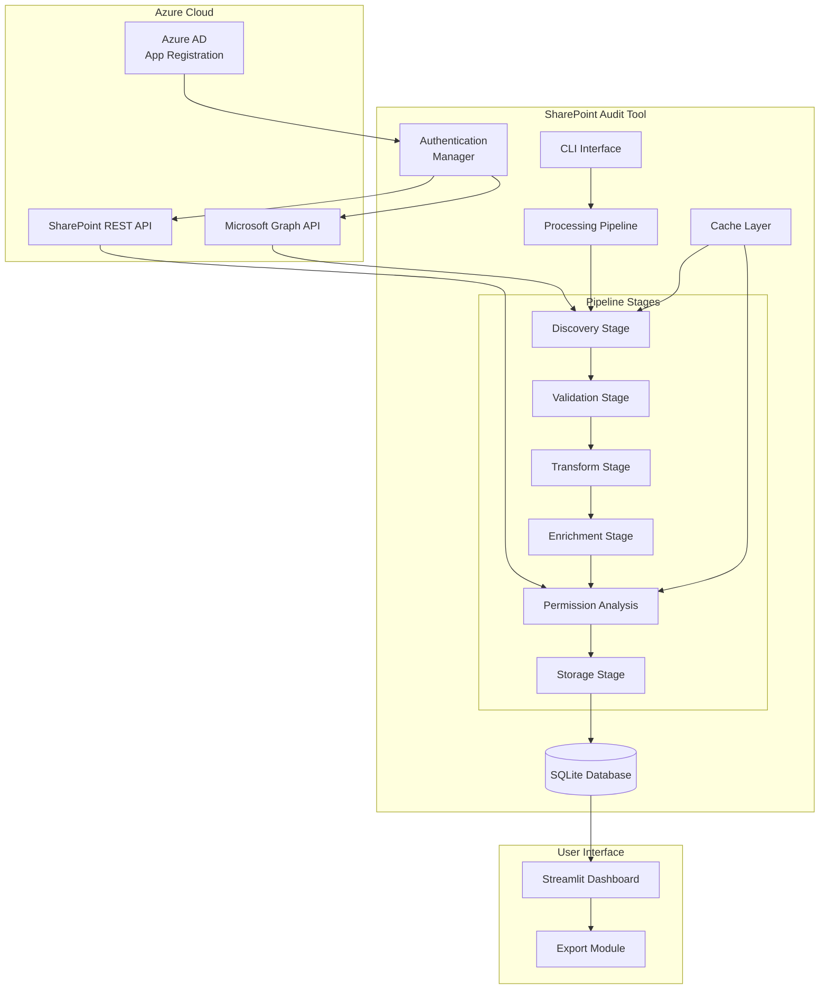

# SharePoint Audit Utility

[](https://www.python.org/downloads/)
[](https://opensource.org/licenses/MIT)
[](https://github.com/psf/black)

## 🚀 Overview

SharePoint Audit Utility is a comprehensive, enterprise-grade Python application designed to audit SharePoint Online tenants at scale. It provides deep visibility into your SharePoint environment by discovering and analyzing all sites, libraries, folders, files, and permissions, presenting the data through an intuitive web dashboard.

### Key Capabilities

- **Complete Tenant Discovery**: Automatically discovers all SharePoint sites, document libraries, folders, and files
- **Deep Permission Analysis**: Analyzes unique permissions, external sharing, inheritance chains, and access patterns
- **Enterprise Performance**: Handles millions of files with async operations, intelligent caching, and rate limiting
- **Resilient Architecture**: Features checkpoint/resume capability, retry logic, and circuit breaker patterns
- **Interactive Dashboard**: Modern Streamlit-based interface with advanced filtering, visualizations, and export capabilities
- **Security-First Design**: Certificate-based authentication, no password storage, comprehensive audit logging

## 📋 Table of Contents

- [Prerequisites](#-prerequisites)
- [Enterprise Setup](#-enterprise-setup-azure-ad-app-registration)
- [Installation](#-installation)
- [Configuration](#-configuration)
- [Usage](#-usage)
- [Architecture](#-architecture)
- [Dashboard Features](#-dashboard-features)
- [Performance & Scaling](#-performance--scaling)
- [Troubleshooting](#-troubleshooting)
- [Security Considerations](#-security-considerations)
- [Development](#-development)

## 📋 Prerequisites

### System Requirements
- **Python**: 3.11 or higher
- **Operating System**: Windows, macOS, or Linux
- **Memory**: Minimum 4GB RAM (8GB+ recommended for large tenants)
- **Storage**: 10GB+ free space (depends on tenant size)

### Azure/Microsoft 365 Requirements
- **SharePoint Online**: Active SharePoint Online subscription
- **Azure AD**: Global Administrator or Application Administrator access (for app registration)
- **Certificate**: Self-signed or CA-issued certificate for authentication

## 🏢 Enterprise Setup: Azure AD App Registration

### Step 1: Create App Registration

1. Navigate to [Azure Portal](https://portal.azure.com)
2. Go to **Azure Active Directory** → **App registrations** → **New registration**
3. Configure the application:
   - **Name**: `SharePoint Audit Tool`
   - **Supported account types**: `Accounts in this organizational directory only`
   - **Redirect URI**: Leave blank (not needed for daemon apps)
4. Click **Register** and note the **Application (client) ID** and **Directory (tenant) ID**

### Step 2: Configure API Permissions

1. In your app registration, go to **API permissions** → **Add a permission**
2. Select **Microsoft Graph** → **Application permissions**
3. Add the following permissions:

#### Required Permissions (Minimum)
```
Sites.Read.All          - Read all site collections
Files.Read.All          - Read files in all site collections
User.Read.All           - Read all users' profiles
Group.Read.All          - Read all groups
```

#### Optional Permissions (Enhanced Features)
```
Sites.FullControl.All   - Full control of all site collections (for write operations)
Directory.Read.All      - Read directory data (for advanced user/group analysis)
Reports.Read.All        - Read usage reports (for activity analytics)
```

4. Click **Grant admin consent** (requires Global Administrator)

### Step 3: Certificate Setup

#### Option A: Self-Signed Certificate (Development/Testing)

```powershell
# Generate self-signed certificate (PowerShell - Run as Administrator)
$cert = New-SelfSignedCertificate -Subject "CN=SharePoint Audit Tool" `
    -CertStoreLocation "Cert:\CurrentUser\My" `
    -KeyExportPolicy Exportable `
    -KeySpec Signature `
    -KeyLength 2048 `
    -KeyAlgorithm RSA `
    -HashAlgorithm SHA256 `
    -NotAfter (Get-Date).AddYears(2)

# Export certificate with private key (.pfx)
$pwd = ConvertTo-SecureString -String "YourStrongPassword" -Force -AsPlainText
Export-PfxCertificate -Cert $cert -FilePath ".\SharePointAudit.pfx" -Password $pwd

# Export public certificate (.cer)
Export-Certificate -Cert $cert -FilePath ".\SharePointAudit.cer"

# Get thumbprint
Write-Host "Certificate Thumbprint: $($cert.Thumbprint)"
```

#### Option B: CA-Issued Certificate (Production)

Use your organization's certificate authority to generate a certificate with:
- **Key Size**: 2048-bit minimum
- **Signature Algorithm**: SHA256
- **Key Usage**: Digital Signature, Key Encipherment
- **Extended Key Usage**: Client Authentication

### Step 4: Upload Certificate to Azure AD

1. In your app registration, go to **Certificates & secrets** → **Certificates**
2. Click **Upload certificate** and select your `.cer` file
3. Verify the thumbprint matches your certificate

### Step 5: Note Required Values

Save these values for configuration:
- **Tenant ID**: `xxxxxxxx-xxxx-xxxx-xxxx-xxxxxxxxxxxx`
- **Client ID**: `yyyyyyyy-yyyy-yyyy-yyyy-yyyyyyyyyyyy`
- **Certificate Thumbprint**: `AAAAAAAAAAAAAAAAAAAAAAAAAAAAAAAAAAAAAAAA`
- **Certificate Path**: Path to your `.pfx` file

## 🛠️ Installation

### 1. Clone Repository
```bash
git clone https://github.com/yourusername/SharepointAudit.git
cd SharepointAudit
```

### 2. Create Virtual Environment
```bash
# Windows
python -m venv venv
venv\Scripts\activate

# macOS/Linux
python3 -m venv venv
source venv/bin/activate
```

### 3. Install Package
```bash
# Production installation
pip install .

# Development installation (editable)
pip install -e ".[dev]"
```

## ⚙️ Configuration

### Directory Structure
```
SharepointAudit/
├── config/
│   └── config.json         # Main configuration
├── .secrets/               # Certificates (git-ignored)
│   ├── SharePointAudit.pfx
│   └── SharePointAudit.cer
└── audit.db               # SQLite database (created on first run)
```

### Configuration File (`config/config.json`)

```json
{
  "auth": {
    "tenant_id": "your-tenant-id-here",
    "client_id": "your-client-id-here",
    "certificate_path": ".secrets/SharePointAudit.pfx",
    "certificate_thumbprint": "your-thumbprint-here",
    "certificate_password": "your-pfx-password"
  },
  "tenant_url": "https://yourtenant.sharepoint.com",
  "db": {
    "path": "audit.db",
    "wal_mode": true,
    "connection_pool_size": 10
  },
  "pipeline": {
    "concurrent_requests": 50,
    "batch_size": 100,
    "checkpoint_interval": 300,
    "rate_limit": {
      "requests_per_minute": 600,
      "burst_size": 20
    }
  },
  "discovery": {
    "include_subsites": true,
    "include_personal_sites": false,
    "max_depth": 10
  },
  "permissions": {
    "analyze_unique_permissions": true,
    "expand_groups": true,
    "include_sharing_links": true
  },
  "cache": {
    "enabled": true,
    "ttl": 3600,
    "max_size": 1000,
    "backend": "memory"
  },
  "logging": {
    "level": "INFO",
    "file": "logs/sharepoint_audit.log",
    "max_size": "10MB",
    "backup_count": 5
  }
}
```

### Environment Variables (Optional)

For added security, use environment variables:
```bash
export SHAREPOINT_TENANT_ID="your-tenant-id"
export SHAREPOINT_CLIENT_ID="your-client-id"
export SHAREPOINT_CERT_PASSWORD="your-password"
```

## 🚀 Usage

### Command Line Interface

#### Full Audit (Recommended First Run)
```bash
# Discover all sites and analyze permissions
sharepoint-audit audit --config config/config.json

# Verbose output with progress bars
sharepoint-audit audit --config config/config.json -vv

# Audit specific sites only
sharepoint-audit audit --config config/config.json --sites "https://tenant.sharepoint.com/sites/HR,https://tenant.sharepoint.com/sites/IT"

# Resume interrupted audit
sharepoint-audit audit --config config/config.json --resume audit_run_20240115_123456
```

#### Launch Dashboard
```bash
# Start dashboard on default port (9999)
sharepoint-audit dashboard --db-path audit.db

# Custom port
sharepoint-audit dashboard --db-path audit.db --port 8080

# No browser launch
sharepoint-audit dashboard --db-path audit.db --no-browser
```

#### System Health Check
```bash
# Test all components
sharepoint-audit health --config config/config.json --check-auth --check-api --check-db audit.db
```

#### Database Management
```bash
# Backup database
sharepoint-audit backup --db-path audit.db --output backups/audit_$(date +%Y%m%d).db

# Compress backup
sharepoint-audit backup --db-path audit.db --output backups/audit_backup.db --compress

# Restore database
sharepoint-audit restore --backup-path backups/audit_backup.db --db-path audit_restored.db
```

### Advanced Usage

#### Scheduled Audits (Windows Task Scheduler)
```xml
<?xml version="1.0" encoding="UTF-16"?>
<Task version="1.2" xmlns="http://schemas.microsoft.com/windows/2004/02/mit/task">
  <Triggers>
    <CalendarTrigger>
      <StartBoundary>2024-01-01T02:00:00</StartBoundary>
      <ScheduleByDay>
        <DaysInterval>1</DaysInterval>
      </ScheduleByDay>
    </CalendarTrigger>
  </Triggers>
  <Actions>
    <Exec>
      <Command>C:\SharepointAudit\venv\Scripts\python.exe</Command>
      <Arguments>-m sharepoint_audit audit --config C:\SharepointAudit\config\config.json</Arguments>
      <WorkingDirectory>C:\SharepointAudit</WorkingDirectory>
    </Exec>
  </Actions>
</Task>
```

#### Scheduled Audits (Linux Cron)
```bash
# Edit crontab
crontab -e

# Add daily audit at 2 AM
0 2 * * * cd /opt/SharepointAudit && ./venv/bin/python -m sharepoint_audit audit --config config/config.json >> logs/audit.log 2>&1
```

## 🏗️ Architecture

### High-Level Architecture



### Component Architecture

```
src/
├── api/                        # External API Integration
│   ├── auth_manager.py        # Azure AD authentication
│   ├── graph_client.py        # Microsoft Graph API client
│   ├── sharepoint_client.py   # SharePoint REST API client
│   └── base_client.py         # Common HTTP client functionality
│
├── core/                       # Business Logic
│   ├── pipeline.py            # Multi-stage processing pipeline
│   ├── discovery.py           # Site/content discovery engine
│   ├── permissions.py         # Permission analysis engine
│   ├── processors.py          # Data transformation processors
│   └── concurrency.py         # Async operation management
│
├── database/                   # Data Persistence
│   ├── models.py              # SQLite schema definitions
│   ├── repository.py          # Data access layer
│   └── optimizer.py           # Query optimization
│
├── cache/                      # Caching Infrastructure
│   ├── cache_manager.py       # Cache orchestration
│   ├── memory_cache.py        # In-memory cache backend
│   └── redis_cache.py         # Redis cache backend
│
├── dashboard/                  # Web Interface
│   ├── streamlit_app.py       # Main dashboard entry
│   ├── comprehensive_app.py   # Full dashboard implementation
│   └── pages/                 # Individual dashboard pages
│       ├── overview.py        # Overview metrics
│       ├── sites.py           # Site analysis
│       ├── permissions.py     # Permission analysis
│       ├── files.py           # File analysis
│       └── export.py          # Data export
│
├── cli/                        # Command Line Interface
│   ├── commands.py            # CLI command implementations
│   ├── config_parser.py       # Configuration management
│   └── output.py              # Rich terminal output
│
└── utils/                      # Utilities
    ├── exceptions.py          # Custom exceptions
    ├── retry_handler.py       # Retry logic
    ├── rate_limiter.py        # API rate limiting
    └── checkpoint_manager.py   # State persistence
```

### Database Schema

```sql
-- Core Tables
CREATE TABLE sites (
    id INTEGER PRIMARY KEY,
    site_id TEXT UNIQUE NOT NULL,
    url TEXT UNIQUE NOT NULL,
    title TEXT,
    description TEXT,
    storage_used BIGINT,
    created_at TIMESTAMP,
    last_synced TIMESTAMP
);

CREATE TABLE libraries (
    id INTEGER PRIMARY KEY,
    library_id TEXT UNIQUE NOT NULL,
    site_id INTEGER REFERENCES sites(id),
    name TEXT NOT NULL,
    item_count INTEGER,
    is_hidden BOOLEAN
);

CREATE TABLE files (
    id INTEGER PRIMARY KEY,
    file_id TEXT UNIQUE NOT NULL,
    library_id INTEGER REFERENCES libraries(id),
    name TEXT NOT NULL,
    size_bytes BIGINT,
    created_at TIMESTAMP,
    modified_at TIMESTAMP,
    has_unique_permissions BOOLEAN
);

CREATE TABLE permissions (
    id INTEGER PRIMARY KEY,
    object_type TEXT NOT NULL,
    object_id TEXT NOT NULL,
    principal_type TEXT NOT NULL,
    principal_id TEXT NOT NULL,
    principal_name TEXT,
    permission_level TEXT,
    is_inherited BOOLEAN,
    is_external BOOLEAN
);

-- Indexes for Performance
CREATE INDEX idx_permissions_object ON permissions(object_type, object_id);
CREATE INDEX idx_permissions_principal ON permissions(principal_type, principal_id);
CREATE INDEX idx_files_library ON files(library_id);
CREATE INDEX idx_files_size ON files(size_bytes);
```

## 📊 Dashboard Features

### Overview Tab
- **Executive Summary**: Key metrics at a glance
- **Permission Distribution**: Visual breakdown of access levels
- **Storage Analytics**: Usage patterns and trends
- **External Access**: External user summary
- **Recent Activity**: Latest changes

### Security Insights Tab
- **Risk Analysis**: High-risk permission patterns
- **External Sharing**: Detailed external access report
- **Overshared Files**: Files with excessive permissions
- **Stale Permissions**: Unused access rights
- **Compliance Gaps**: Policy violations

### File Analysis Tab
- **File Distribution**: By type, size, age
- **Large Files**: Storage optimization opportunities
- **Duplicate Detection**: Similar file identification
- **Sensitive Content**: Pattern-based detection
- **Version Analysis**: Version history insights

### Permission Matrix Tab
- **User-Object Matrix**: Visual permission grid
- **Heat Maps**: Permission density visualization
- **Access Paths**: Permission inheritance chains
- **Group Expansion**: Nested group analysis

### Export Tab
- **Multi-Format Export**: Excel, CSV, JSON
- **Custom Reports**: Filtered data exports
- **Scheduled Reports**: Automated report generation
- **Compliance Reports**: Audit-ready formats

## 🚀 Performance & Scaling

### Performance Optimization

#### For Large Tenants (1M+ files)
```json
{
  "pipeline": {
    "concurrent_requests": 100,
    "batch_size": 500,
    "checkpoint_interval": 120
  },
  "cache": {
    "backend": "redis",
    "max_size": 10000
  },
  "db": {
    "connection_pool_size": 20,
    "wal_mode": true
  }
}
```

#### Memory Management
```bash
# Monitor memory usage
sharepoint-audit audit --config config/config.json --memory-profile

# Limit memory usage
export SHAREPOINT_AUDIT_MAX_MEMORY=4G
```

### Scaling Strategies

1. **Horizontal Scaling**: Run multiple instances targeting different site collections
2. **Incremental Updates**: Use checkpoint/resume for partial updates
3. **Selective Auditing**: Target specific sites or libraries
4. **Off-Peak Processing**: Schedule during low-usage periods

## 🔧 Troubleshooting

### Common Issues and Solutions

#### Authentication Failures
```
Error: AADSTS700016: Application not found in the directory
```
**Solution**: Verify tenant ID and client ID in config.json

```
Error: AADSTS700027: Client assertion contains an invalid signature
```
**Solution**: Check certificate thumbprint and ensure .pfx password is correct

#### API Throttling
```
Error: 429 Too Many Requests - Retry after: 60
```
**Solution**:
```json
{
  "pipeline": {
    "rate_limit": {
      "requests_per_minute": 300,
      "burst_size": 10
    }
  }
}
```

#### Database Issues
```
Error: database is locked
```
**Solution**: Enable WAL mode in configuration or close other connections

#### Memory Issues
```
Error: Process killed due to excessive memory usage
```
**Solution**: Reduce batch_size or process sites individually

### Debug Mode
```bash
# Maximum verbosity
sharepoint-audit audit --config config/config.json -vvv

# Debug specific component
export SHAREPOINT_AUDIT_DEBUG=permissions
sharepoint-audit audit --config config/config.json

# Generate debug bundle
sharepoint-audit debug --create-bundle --output debug_bundle.zip
```

## 🔒 Security Considerations

### Best Practices

1. **Certificate Security**
   - Store certificates in encrypted locations
   - Use strong passwords for .pfx files
   - Rotate certificates annually
   - Never commit certificates to version control

2. **Access Control**
   - Limit dashboard access to authorized users
   - Use network segmentation for the audit tool
   - Implement audit log monitoring

3. **Data Protection**
   - Encrypt database at rest
   - Use secure transport (HTTPS only)
   - Implement data retention policies
   - Anonymize sensitive data in exports

### Compliance

The tool supports various compliance requirements:
- **GDPR**: Data minimization and retention controls
- **HIPAA**: Audit trail and access logging
- **SOC 2**: Security controls and monitoring
- **ISO 27001**: Information security management

## 👨‍💻 Development

### Development Setup
```bash
# Clone repository
git clone https://github.com/yourusername/SharepointAudit.git
cd SharepointAudit

# Create virtual environment
python -m venv venv
source venv/bin/activate  # or venv\Scripts\activate on Windows

# Install development dependencies
pip install -e ".[dev]"

# Install pre-commit hooks
pre-commit install
```

### Running Tests
```bash
# Run all tests
pytest

# Run with coverage
pytest --cov=src --cov-report=html

# Run specific test categories
pytest -m "not slow"      # Skip slow tests
pytest -m integration     # Integration tests only
pytest -m unit           # Unit tests only
```

### Code Quality
```bash
# Format code
black src/ tests/

# Lint code
flake8 src/ tests/
pylint src/

# Type checking
mypy src/

# Security scanning
bandit -r src/
```

### Contributing

1. Fork the repository
2. Create a feature branch (`git checkout -b feature/amazing-feature`)
3. Make your changes
4. Run tests (`pytest`)
5. Commit (`git commit -m 'Add amazing feature'`)
6. Push (`git push origin feature/amazing-feature`)
7. Open a Pull Request

## 📝 License

This project is licensed under the MIT License - see the LICENSE file for details.

## 🙏 Acknowledgments

- Microsoft Graph API Documentation
- SharePoint REST API Reference
- Streamlit Community
- AsyncIO Documentation
- All contributors and testers

## 📞 Support

- **Documentation**: See `/docs` folder for detailed guides
- **Issues**: Open an issue on GitHub
- **Discussions**: Use GitHub Discussions for questions
- **Security**: Report security issues privately

---

**Note**: This tool is designed for auditing and compliance purposes. Always ensure you have appropriate permissions before scanning SharePoint environments.
